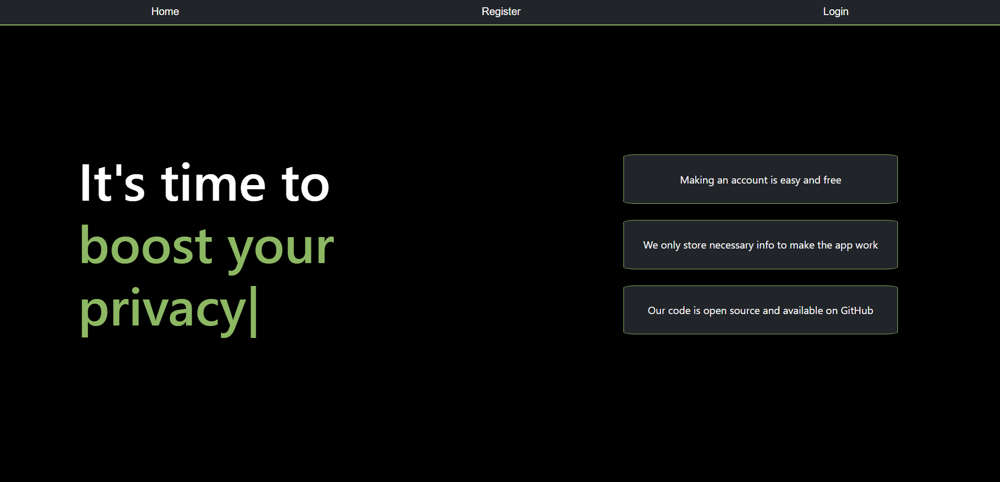
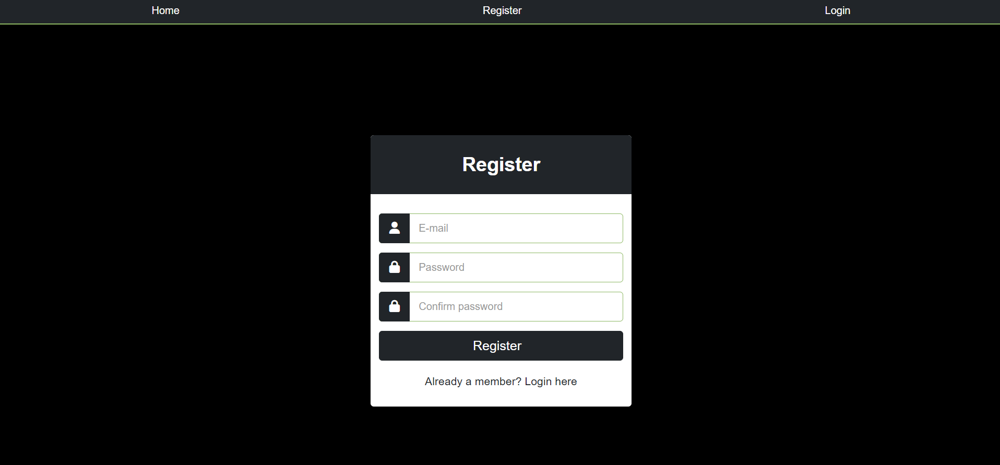
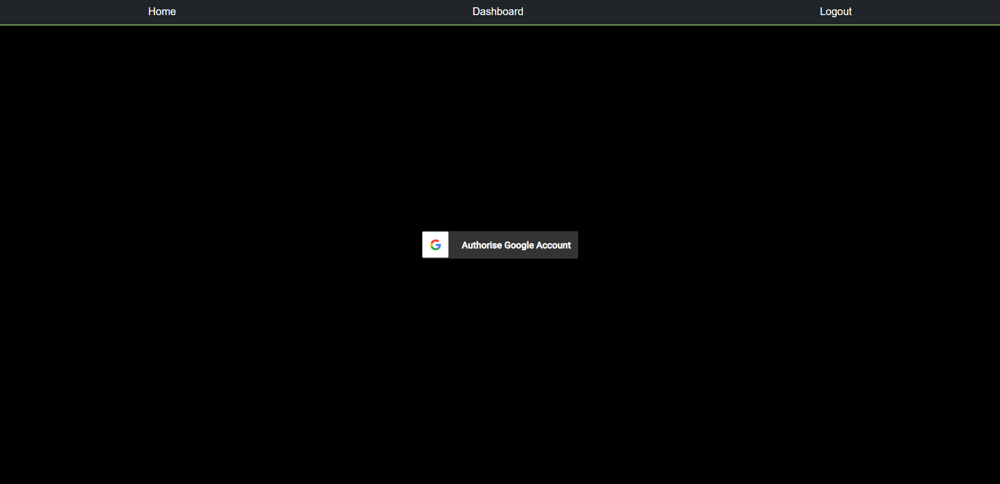
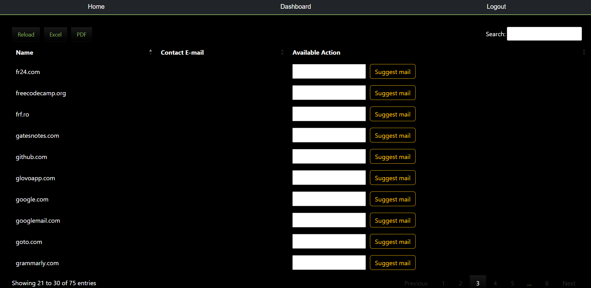

# DataManager

<p align="center">
  
</p>

DataManager is an online data management web application made using Spring that allows users to view the services they interacted with by scanning their email and allowing them to send emails to services to get their online data erased. Technologies used:

* [Java 17](https://www.oracle.com/java/technologies/javase-downloads.html)
* [Spring](https://spring.io/)
* [Maven](https://maven.apache.org/) (build tool)
* [PostgreSQL](https://www.postgresql.org/download/) (as Database)

## Prerequisites
To be able to install and run this project, please make sure you have installed Java 17 or higher. Otherwise, the setup will not work!
To check your Java version, please run `java -version` in the command line.

To install a newer version of Java, you can go to [Oracle](https://www.oracle.com/java/technologies/javase-downloads.html) or [OpenJDK](https://jdk.java.net/).

It would be good if you also installed Maven to your system. To check if you have Maven installed run `mvn -version`.

If you need to install any of them, please refer to this [Maven tutorial](https://www.baeldung.com/install-maven-on-windows-linux-mac).

## How to build
To set up and run the project locally on your machine, please follow the next steps.

### Clone the repository
Clone the repository using:
```git
git clone https://github.com/efrem-upt/DataManager
```

### Verify that the project Builds locally
Open a command line session and `cd DataManager`.
If you have installed all the prerequisites, you should be able to run any of the following commands:
```
mvn clean install
```
If you prefer to run using the wrappers, you could also build the project using 
```
./mvnw clean install (for Linux or MacOS)
or 
mvnw.cmd clean install (for Windows)
```

### Setup the database

Open `psql` and create the `dm_storage` database by typing `CREATE DATABASE dm_storage`. The database name can be modified based on needs via the `application.properties` file, by changing `spring.datasource.url=jdbc:postgresql://localhost:5432/dm_storage` to `spring.datasource.url=jdbc:postgresql://localhost:5432/*your desired name here*`.

Open the `application.properties` file and modify the lines:

```
spring.datasource.username=username
spring.datasource.password=password
```

to match the correct username and password for the PostgreSQL user that has granted privileges on the database `dm_storage` (or the name chosen).

### Setup the Mail server (localhost email testing)

Install `Maildev` from `https://github.com/maildev/maildev`.

Start `Maildev` by typing `maildev` in the command line. By default, this will configure the web application to run on port `1080` and the mail server will run on port `1025`. This can be configured in Maildev settings, but if the mail server port is modified, the modification will also need to be reflected in the `spring.mail.port=1025` line in `application.properties` file.

### Generate the credentials.json file

1. Visit `https://console.cloud.google.com/apis/dashboard` and log in or sign up for a Google Cloud account
2. Create a new project (see https://cloud.google.com/resource-manager/docs/creating-managing-projects for help)
3. Head over to the `API & Services` section of your project, go to `Credentials` then to `Create Credentials`
4. Select `OAuth Client ID` and then `Web Application`, for `Authorized Redirect URIs` type `http://localhost:8081/Callback` and press the `Create` button
5. Press the `download JSON` button, rename it `credentials.json` and place it in the `Resources` folder
6. Head over to the `OAuth consent screen` menu and add your Google account email as the test user (and make sure the app is in testing phase)

### Run the app

Run the main method of the `DatamanagerApplication` class.

## How it works

When a user signs up on DataManager, they will be prompted to connect their Google account. Once they do that, DataManager will scan the user's email using Google's gMail API and will create a list of the interactions they had with companies that the user can view. The user can then
choose a service they wish to remove their data from and press the button "Send email" so an email is sent from the associated Google account to the corresponding inbox of the company the user has selected that addresses this type of requests.

Because this service relies on a database of emails corresponding to companies, there is the chance that the service does not have the email for a corresponding company in the database. In this case, the user is presented with the choice to "Suggest an email".
When the user suggests an email, it is sent to a moderator that reviews it and approves or rejects the suggestions. If they approve it, all users who had that company in their interactions list
will be able to send an email to that company via DataManager, telling them that they want their data removed from their systems.

## Features
There are three roles: user, moderator and admin.

- Connect your Google account and scan your gmail. Connection can happen only after the user created an account on the service;
- Get a list of the websites you've used in the past based on your gmail account;
- Extract the list in PDF or Excel format;
- Suggest contact email for services whose email is not stored in the database;
- Submit emails via DataManager to the service you wish to delete your data from, the email will be sent on your behalf and from your gmail account.
- Moderators can view suggestions made by users and approve or reject them;
- Admin only has the power to delete users.

## Screenshots
The home page: 

<p align="center">
  
</p>

The registration page:

<p align="center">
  
</p>

The dashboard page (before linking Google account):

<p align="center">
  
</p>

The dashboard page (after linking Google account):

<p align="center">
  
</p>

## License

[MIT](https://choosealicense.com/licenses/mit/)
